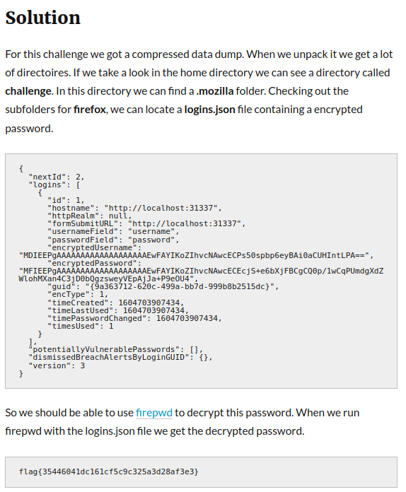

# Dumpster Fire
## Tags: Forensics
**Author: @JohnHammond**
**50 points easy**

We found all this data in the dumpster! Can you find anything interesting in here, like any cool passwords or anything? Check it out quick before the foxes get to it!

Download the attached file.

The file is in tar.xz format, so i searched how to extract it.

First, I decompress the xz file.
```console
$ xz -d -v dumpster_fire.tar.xz
```
Then, extract it by using tar command
```console
$ tar -xf dumpster_fire.tar
```
It outputs a lot of directories, I tried to grep with "password", but it give me hard time to find the correct one. I also checked with "fox"

based from the description the hint must be the password is in firefox. By searching in Huntress discord i found more clue.

I tried to grep with "username" and it outputs encrypted username and password.
```console
{"nextId":2,"logins":[{"id":1,"hostname":"http://localhost:31337","httpRealm":null,"formSubmitURL":"http://localhost:31337","usernameField":"username","passwordField":"password","encryptedUsername":"MDIEEPgAAAAAAAAAAAAAAAAAAAEwFAYIKoZIhvcNAwcECPs50spbp6eyBAi0aCUHIntLPA==","encryptedPassword":"MFIEEPgAAAAAAAAAAAAAAAAAAAEwFAYIKoZIhvcNAwcECEcjS+e6bXjFBCgCQ0p/1wCqPUmdgXdZWlohMXan4C3jD0bQgzsweyVEpAjJa+P9eOU4","guid":"{9a363712-620c-499a-bb7d-999b8b2515dc}","encType":1,"timeCreated":1604703907434,"timeLastUsed":1604703907434,"timePasswordChanged":1604703907434,"timesUsed":1}],"potentiallyVulnerablePasswords":[],"dismissedBreachAlertsByLoginGUID":{},"version":3}
```
I google how to decrypt the password and i found this writeup from grimmcon ctf 2020
https://klefz.se/2020/12/31/grimmcon-ctf-2020-writeup/

